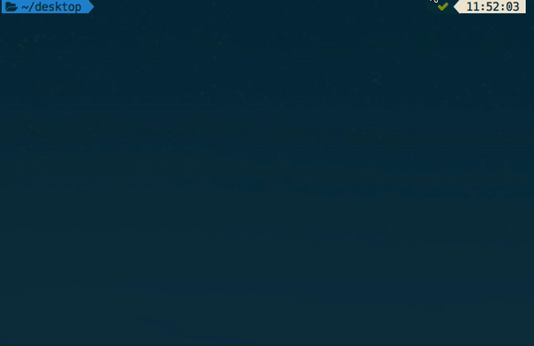

[](https://travis-ci.org/andy6804tw/sharefile)
[](https://coveralls.io/github/andy6804tw/sharefile?branch=master)
[![NPM version][npm-image]][npm-url] 
[![GitHub license][license-image]][license-url]

# ShareFile
file sharing to the world !

- no occupy cloud storage.
- no file size limit.
- use your local tunnel to share files



## Install
```bash
npm install -g sharefile
```

## Usage
Generate share URL link.

```bash
# sharefile [your file]
# ex:

sharefile demo.png
```

> tip: `ctrl+c` to break command line

## Contribute
### Report Issues and Improvement Suggestions
File report at this project's [issue](https://github.com/andy6804tw/sharefile/issues) tracker if you noticed some problem or have improvement suggestions.
### Contribute to This Project
Create your [fork](https://github.com/andy6804tw/sharefile/fork) repository, create and switch to a new Git branch, do your edits and commit as a new version, push them to your remote repository on GitHub and file us a [pull request](https://github.com/andy6804tw/sharefile/pulls) !
### Promote
Promote this project so that more people recognize it !

## LICENSE
MIT

## Reference
http://stackabuse.com/read-files-with-node-js/


[npm-image]: https://img.shields.io/badge/npm-v1.3.2-blue.svg
[npm-url]: https://www.npmjs.com/package/sharefile

[license-image]: https://img.shields.io/badge/license-MIT-blue.svg
[license-url]: https://github.com/andy6804tw/sharefile/blob/master/LICENSE
